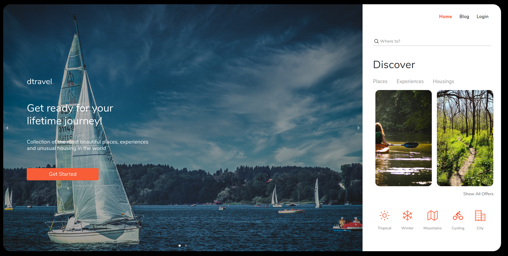
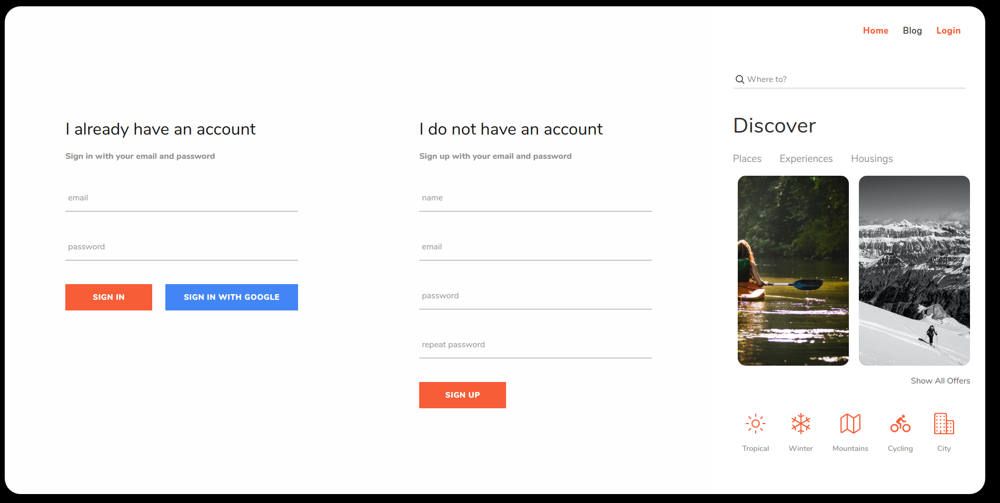

## About: 
This was a group project from **DCI's WEB Development Course**, which We attended between 2019 - 2021.

# Find the vacation of your dreams with Dtravel!

 A platform that helps you find a special vacation in line with your taste.
 Check the filters to sort our destinations according to your wish, whether it is a tropical, snowy, hiking, cycling trip, or just a city tour.
### Take our quiz for more personalized offers!

## Contact
Currently being developed by [Claudinei Bido](https://www.linkedin.com/in/bidoc/) - feel free to contact me!

## Original Team
- [Bido](https://www.linkedin.com/in/bidoc/)
- [Alex](https://github.com/hadabr)
- [Simona](https://github.com/SimonaHriscu)
- [Yaman](https://github.com/YamanKatmawi)

## 🚀 Technologies used
 


## RoadMap
## V5
- [ ] Admin Panel
- [ ] REST API with Express
- [ ] Database with MongoDB / Mongoose

## V4
- [x] APP UI refactored.
- [x] Redux Persist (Local Storage)
- [x] Favorites List

## V3
- [x] Authtentication using Firebase / Firestore
- [x] Redux Hooks (useSelector, useDispatch)
- [x] React Hooks (useState, useEffect)
- [X] APP UX refactored.

## V2
- [x] Filters / Adventurous Mood
- [x] All Offers / Quiz

## V1
- [x] UI / UX APP Structure
- [x] Redux / Search Engine

## Files Structure

```
Project
│   README.md
│   package.json
|   package-lock.json
|   .gitignore
|
└─── public
│      │
│      └─── index.html
|      └─── img
│            └─── img-background
|
|
└─── src
      └─── index.js
      └─── App.js
      │
      └─── components
      │        └─── aside
      |        |        └─── aside.component.jsx
      |        |        └─── adventurousmood
      |        |        └─── header
      |        |        └─── main
      |        |        └─── search
      |        └─── intro
      |        |        └─── intro.component.jsx
      |        |        └─── about
      |        |        └─── blog
      |        |        └─── landing
      |        |        └─── quiz
      |        └─── offers
      |                 └─── handleOfferSearch.js
      |                 └─── list-item.component.jsx
      |                 └─── OffersEndList.component.js
      │       
      |            
      │       
      |              
      |                
      └─── scss
      │        └─── main.scss
      │        └─── _app.scss
      |                 └─── _aside.scss
      |                 └─── _intro.scss
      |                 └─── _offers.scss
      |
      └─── redux
               └─── store
               |        └─── background-img.js
               |        └─── data.json
               |        └─── index.js
               └─── actions.js
               └─── data-reducer.js
               └─── imgs-bg-reducer.js
               └─── login-reducer.js
               └─── root-reducer.js
               └─── search-input.reducer.js
               
``` 

## Preview:


